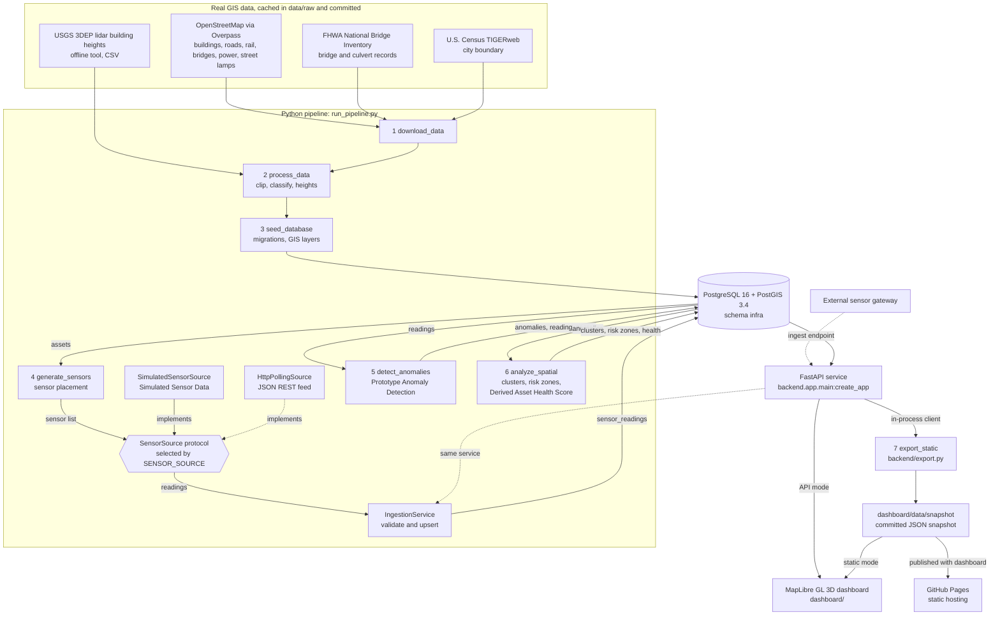

# Dodge City 3D Urban Infrastructure Monitoring & GeoAI Dashboard

A research prototype that shows how urban infrastructure assets in a study area of **Dodge City, Kansas** can be
monitored spatially: real public GIS data is processed in Python and stored in PostgreSQL/PostGIS, a simulated
sensor network produces hourly readings, a prototype anomaly detection and a PostGIS-based spatial analysis run on
those readings, and a FastAPI service feeds an interactive MapLibre 3D dashboard with time playback.

> **Data notice.** Sensor readings, sensor status, anomalies, risk zones and asset health scores are simulated or
> derived from simulated data. They are not a record of the real condition of any structure in Dodge City. This is
> not a certified infrastructure safety system and it does not predict structural failure. The dashboard and the
> API label these parts as **Simulated Sensor Data**, **Prototype Anomaly Detection** and **Derived Asset Health
> Score**.

Contents: [1 Overview](#1-project-overview) · [2 Architecture](#2-architecture) ·
[3 Stack](#3-technology-stack) · [4 Data sources](#4-data-sources) · [5 Provenance](#5-data-provenance) ·
[6 Database](#6-database-schema) · [7 Sensors](#7-sensor-simulation-simulated-sensor-data) ·
[8 Detection](#8-anomaly-detection-prototype-anomaly-detection) ·
[9 Spatial analysis](#9-spatial-analysis-and-derived-asset-health-score) · [10 Run locally](#10-running-locally) ·
[11 Docker](#11-docker-setup) · [12 Environment](#12-environment-variables) · [13 API](#13-api-endpoints) ·
[14 Testing](#14-testing) · [15 Limitations](#15-limitations) ·
[16 Real sensors](#16-future-real-sensor-integration) · [17 Deployment](#17-deployment) ·
[18 Reused](#18-what-was-reused) · [19 New](#19-what-is-new) · [20 Remaining](#20-remaining-limitations)

Further documentation: [data provenance](docs/data-provenance.md) · [health score](docs/health-score.md) ·
[anomaly detection](docs/anomaly-detection.md) · [API reference](docs/api.md) · [deployment](docs/deployment.md) ·
[real-sensor integration](docs/real-sensor-integration.md) · [LiDAR height tool](tools/README.md)

---

## 1. Project overview

**What it is.** One coherent application, not a set of demos:

```
GIS data -> Python processing -> PostGIS -> simulated sensors -> anomaly detection -> spatial analysis -> API -> 3D dashboard
```

**Where.** "Downtown Dodge City, Kansas": a configurable rectangle of about 2.2 km x 1.9 km
(`STUDY_AREA_BBOX=37.745,-100.030,37.762,-100.005`, south,west,north,east).

**What is in the default dataset** (seed 42; every number below is returned by `GET /meta` and
`GET /statistics`, nothing is hard-coded in the dashboard):

| | |
|---|---|
| Infrastructure assets | 706 = 678 real (458 buildings, 137 roads, 50 rail segments, 4 bridges/culverts, 3 power, 26 street lights) + 28 simulated water mains |
| Monitored assets (at least one sensor) | 112 |
| Simulated sensors | 128 (36 vibration, 30 temperature, 34 moisture, 28 pressure) |
| Simulated readings | 92,028 hourly readings over 30 days (2026-09-01 00:00 to 2026-09-30 23:00 America/Chicago) |
| Anomalies (Prototype Anomaly Detection) | 42: 3 critical, 17 high, 17 medium, 5 low |
| Co-occurrence clusters / risk-zone cells | 3 / 88 hexagonal cells |
| At the last hour of the window | 126 sensors reporting, 2 offline, 6 active anomalies, 1 critical alert, 6 assets at risk |
| Building heights | 419 measured from USGS 3DEP lidar, 39 estimated by rule |

**What the dashboard shows.** A 3D map (building extrusions, roads, bridges, simulated water network, sensors,
active anomalies, risk zones), five KPI cards (Total Assets, Active Sensors, Active Anomalies, Critical Alerts,
Assets at Risk), Assets / Anomalies / Sensors panels with filters and charts, and an hourly playback of the 30-day
window. It runs against the API ("API mode") or, without any server, from a committed JSON snapshot ("static
mode", used for GitHub Pages).

---

## 2. Architecture



Solid arrows are what runs by default; dotted arrows are the integration points for real sensor data
([section 16](#16-future-real-sensor-integration)).

**Separation of concerns (brief R14).** Data generation (`pipeline/sensors/simulator.py`), ingestion
(`pipeline/sensors/ingestion.py`), processing (`pipeline/detection/`, `pipeline/analysis/`), storage (PostGIS,
`sql/migrations/`), API (`backend/app/`) and visualisation (`dashboard/`) are separate modules. Detection reads only
`infra.sensor_readings`; the API reads only the database; the dashboard reads only the API or the snapshot.

**Pipeline stages.** Each stage is a `main(argv) -> int` in `pipeline/stages/` (stage 7 in `backend/export.py`), is
idempotent, runs its database work in one transaction, and has a thin wrapper in `scripts/`. `run_pipeline.py` runs them in
order in one process.

| # | Script | Reads | Writes |
|---|---|---|---|
| 1 | `scripts/download_data.py [--refresh]` | Overpass, ArcGIS, TIGERweb (or the cache) | `data/raw/{osm.json, nbi_bridges.json, city_boundary.geojson, SOURCES.json}` |
| 2 | `scripts/process_data.py` | `data/raw/*` (+ `building_heights_3dep.csv`) | `data/processed/*.geojson`, `processing_report.json` (no database) |
| 3 | `scripts/seed_database.py [--reset-schema]` | `data/processed/*`, `SOURCES.json` | migrations; `data_sources`, `study_areas`, `reference_boundaries`, `buildings`, `roads`, `infrastructure_assets`, `sensor_thresholds` |
| 4 | `scripts/generate_sensors.py` | assets | simulated `water_main` assets, `sensors`, `sensor_readings`, `simulation_events` |
| 5 | `scripts/detect_anomalies.py` | `sensor_readings`, `sensors`, `sensor_thresholds` (+ `simulation_events` for evaluation only) | `detection_runs`, `reading_scores`, `anomalies` |
| 6 | `scripts/analyze_spatial.py` | anomalies, readings, assets | `anomaly_clusters`, `risk_zones`, `risk_zone_scores`, `asset_health` |
| 7 | `scripts/export_static.py [--output DIR]` | the API, in process | `dashboard/data/snapshot/*` |

`run_pipeline.py` options: `--refresh` (download again), `--skip-download` (use the committed cache),
`--skip-export` (leave the committed snapshot untouched), `--only STAGE`, `--from STAGE` (name or number).

---

## 3. Technology stack

| Layer | Technology |
|---|---|
| Database | PostgreSQL 16.4 + PostGIS 3.4.3 (`postgis/postgis:16-3.4` image); `ST_HexagonGrid`, geography KNN, expression GiST indexes |
| Pipeline | Python 3.12 (`requires-python >= 3.11`), psycopg 3 (synchronous, COPY for bulk loads), numpy, scikit-learn (Isolation Forest, DBSCAN), pydantic-settings, httpx. GIS processing is pure Python: no GDAL, shapely, pandas or geopandas in the application environment |
| API | FastAPI + uvicorn, `psycopg_pool` connection pool, gzip, CORS from the environment, OpenAPI docs at `/docs` |
| Dashboard | Vanilla JavaScript ES modules, no build step; MapLibre GL JS 5.24.0 vendored in `dashboard/vendor/maplibre-gl/`; OpenFreeMap basemap (display only), optional USGS orthoimagery |
| Optional tool | `tools/derive_building_heights.py` with rasterio in a separate environment (`.venv-tools`) |
| Tests | pytest (unit + PostGIS integration), `node --test` for frontend modules, ruff |
| Packaging | `docker-compose.yml` (db + backend), `backend/Dockerfile` (python:3.12-slim, non-root), GitHub Actions (`ci.yml`, `pages.yml`) |

Runtime dependencies are in `requirements.txt`; `requirements-dev.txt` adds pytest, pytest-cov and ruff.

---

## 4. Data sources

All real data is downloaded once by stage 1, cached in `data/raw/` and committed, so the pipeline, the tests, CI and
the Docker image never need the network. `data/raw/SOURCES.json` records, per file, the URL, retrieval time,
sha256, feature count, licence, attribution text and vintage. Details per source:
[docs/data-provenance.md](docs/data-provenance.md).

| source_id | What | Endpoint | Vintage / retrieved | Licence and credit |
|---|---|---|---|---|
| `osm` | Building footprints, highways, rail, `bridge=yes` ways, power substations and lines, street lamps, names and tags | Overpass API (`https://overpass-api.de/api/interpreter`, two mirrors as fallback), one combined `out geom` query | OSM base 2026-10-04T11:58:25Z; retrieved 2026-10-04T12:00:24Z; 896 elements | ODbL 1.0. "Contains OpenStreetMap data © OpenStreetMap contributors, available under the Open Database License (https://opendatacommons.org/licenses/odbl/1-0/)" |
| `nbi` | Highway bridge and culvert records with their recorded attributes | ArcGIS FeatureServer `NTAD_National_Bridge_Inventory/FeatureServer/0` (envelope = bbox) | "data as of June 20, 2025"; retrieved 2026-10-04T12:00:28Z; 4 records | US Government work, unrestricted public use. "FHWA National Bridge Inventory (data as of June 20, 2025), distributed by USDOT/BTS NTAD" |
| `tiger` | Dodge City incorporated-place boundary (context outline only) | TIGERweb `Places_CouSub_ConCity_SubMCD/MapServer/4`, `GEOID='2018250'` | "Incorporated Places; January 1, 2026 vintage"; retrieved 2026-10-04T12:00:30Z | US Government work. "U.S. Census Bureau, TIGERweb". A statistical boundary, not a legal land description |
| `usgs_3dep` | Measured building heights (`data/raw/building_heights_3dep.csv`, 424 footprints) | USGS 3DEP lidar rasters via Microsoft Planetary Computer (`3dep-lidar-dsm` minus `3dep-lidar-dtm-native`), produced offline by `tools/derive_building_heights.py` | Lidar collected 2013-12-12 to 2014-01-22 (project KS_Area1_2014); retrieved 2026-10-04T11:59:36Z | US public domain. "U.S. Geological Survey, 3D Elevation Program" |
| `basemap` | Dark vector basemap (display only, not stored) | `https://tiles.openfreemap.org/styles/dark` | n/a | "OpenFreeMap © OpenMapTiles Data from OpenStreetMap" |
| `imagery` | Orthoimagery toggle (display only, not stored) | USGS The National Map `USGSImageryOnly` tiles | n/a | US public domain. "USDA, USGS The National Map: Orthoimagery" |

Two further `data_sources` rows describe what this project produces: `simulator` (kind `simulated`) and `derived`
(kind `derived`). If a source cannot be downloaded and no cache exists, `osm` is fatal and the other layers are
skipped with a warning (the layer is then absent).

---

## 5. Data provenance

Every row and every API object carries its provenance: `data_sources.kind` (`real` / `simulated` / `derived`),
`is_simulated` on assets, sensors, readings and anomalies, and `height_source` on buildings. Real features carry only
attributes that come from their source; nothing is invented for them.

| Kind | What | Count (default dataset) | Where it comes from |
|---|---|---|---|
| **REAL** | Building footprints | 458 | Closed OSM ways with a `building` tag whose centroid is in the study area and footprint >= 25 m² (485 in the download: 26 smaller, 1 centroid outside) |
| REAL | Road assets / base-map road rows | 137 / 314 | OSM highways of class motorway ... residential (+ `_link`) become assets; service roads, footways and tracks are base map only. Lines are clipped to the study area |
| REAL | Rail, power, street lights | 50 / 3 / 26 | OSM `railway=rail`, `power` substations and lines, `highway=street_lamp` nodes |
| REAL | Bridges and culverts | 4 | 2nd Avenue bridge over the Arkansas River (2 OSM ways merged, matched to NBI 406950290827010 at 0.8 m), the CVRR rail-spur bridge (OSM), two NBI culverts as point assets (West Trail St, Wyatt Earp Blvd) |
| REAL | NBI attributes (year built, condition codes, ADT, inspection date) | 3 records | Shown as recorded, labelled "Fair (FHWA classification from the lowest component rating)" etc. They **never** feed the health score, status colours or risk zones |
| REAL | Building heights, `height_source = lidar_3dep` | 419 | 90th percentile of the lidar height above ground inside the footprint ([tools/README.md](tools/README.md)) |
| DERIVED | Building heights, `height_source = estimated` | 39 | Deterministic rule, no randomness: house/residential/detached/cabin 5.0 m; garage/shed/roof/pavilion 3.5 m; industrial/warehouse 9.0 m; storage_tank 10.0 m; otherwise 4.5 m (< 400 m²), 6.0 m (< 1,500 m²), else 8.0 m. Precedence: OSM `height` tag > lidar > `building:levels` x 3.6 m > rule; here no building has a `height` tag and every building with a levels tag has a lidar height |
| **SIMULATED** | Water mains (`asset_type = water_main`) | 28 | 4.5 m offsets of real street centre lines, created only to host the 28 pressure sensors. Label: "Simulated water network (not a record of real utilities)" |
| SIMULATED | Sensors, readings, sensor status, simulated weather | 128 / 92,028 | `pipeline/sensors/` ([section 7](#7-sensor-simulation-simulated-sensor-data)) |
| SIMULATED | Ground truth of the simulator (`simulation_events`) | 44 | 40 injected abnormal events + 3 rain events + 1 hot spell (benign) |
| **DERIVED** | Anomalies, flagged readings, clusters, risk zones, asset health | 42 / 1,449 / 3 / 88 cells / 112 assets | `pipeline/detection/`, `pipeline/analysis/` ([sections 8](#8-anomaly-detection-prototype-anomaly-detection) and [9](#9-spatial-analysis-and-derived-asset-health-score)) |

**Building heights.** The dashboard caption is fixed: "3D building extrusions derived from OSM footprints.
Heights: measured from USGS 3DEP lidar (2013–14) where available, otherwise OSM tags, otherwise estimated. Not
detailed 3D building models." Three measured heights are known **not** to describe the building they are attached
to (details in [tools/README.md](tools/README.md)):

- *Holiday Inn Express & Suites* (OSM way 1003769677): built after the 2013-14 lidar; the 6.0 m comes from an older
  structure under part of the footprint.
- The annex of the First National Bank Building (way 965214125, OSM `building:levels=1`) gets 17.8 m from the
  taller neighbouring part.
- A two-level part of the Ford County Government Center (way 965217140) gets 17.8 m the same way.

Other buildings altered or replaced since 2014 keep their 2014 height.

**Rejected NBI record.** NBI record `999905600290641` ("US-56 HWY" over the Arkansas River) has recorded
coordinates (items 16/17) 3,841 m away from its point geometry, which lies next to the 2nd Avenue bridge. It fails
the 500 m coordinate check, so no asset is created from it; it is listed under `nbi.mismatched` in
`data/processed/processing_report.json`.

**Why the water network is simulated.** OpenStreetMap does not map water mains here. The City of Dodge City
publishes utility layers, but without a licence that permits reuse, so they are deliberately not used. The 28
simulated mains exist only to give the pressure sensors a plausible host; they have no attributes except their host
road and length, and every view labels them as simulated.

---

## 6. Database schema

Schema `infra`, SRID 4326 for storage, `timestamptz` in UTC, metric work in UTM 14N (EPSG:32614) or on the geography
type. Migrations: `sql/migrations/001_schema.sql` (tables, constraints, indexes) and
`sql/migrations/002_views_functions.sql` (views, functions), applied in order by `pipeline/db/migrate.py` and
recorded in `infra.schema_migrations`. Both files can also be run by hand with `psql -v ON_ERROR_STOP=1 -f ...`.
The database holds exactly one study area (unique index on `study_areas ((true))`); deleting it cascades to
everything.

**Relationships.**

```
study_areas 1─* buildings, roads, reference_boundaries, risk_zones, infrastructure_assets
infrastructure_assets 1─* sensors 1─* sensor_readings 1─1 reading_scores
sensor_readings (sensor_id, ts) 1─* anomalies (sensor_id, peak_at)      <- reading -> anomaly FK
infrastructure_assets 1─* anomalies, asset_health, simulation_events
anomaly_clusters 1─* anomalies (cluster_id, ON DELETE SET NULL)
detection_runs 1─* reading_scores, anomalies, anomaly_clusters, asset_health, risk_zone_scores
risk_zones 1─* risk_zone_scores
```

| Table | Key columns | Notes |
|---|---|---|
| `schema_migrations` | `version` PK, `applied_at` | migration log |
| `data_sources` | `source_id` PK, `kind` CHECK in (real, simulated, derived), `license`, `attribution_text`, `vintage`, `retrieved_at` | 8 rows |
| `study_areas` | `study_area_id`, `slug` UNIQUE, `utm_srid`, `timezone`, `geom Polygon` | one row |
| `reference_boundaries` | `kind`, `source_id` FK, `geom MultiPolygon` | TIGER city limits |
| `buildings` | `osm_id` UNIQUE, `height_m` CHECK > 0, `height_source` CHECK in (osm_height, lidar_3dep, osm_levels, estimated), `footprint_m2`, `geom Polygon` CHECK `ST_IsValid` | 458 rows |
| `roads` | `osm_id` UNIQUE, `highway_class`, `is_bridge`, `length_m`, `geom LineString` | 314 rows (base map) |
| `infrastructure_assets` | `asset_id` PK (`BLD-0001`, `RD-0001`, `BRG-001`, `RAIL-001`, `PWR-001`, `SL-001`, `WM-001`), `asset_type` CHECK, `category`, `building_id` UNIQUE FK, `road_id` FK, `is_simulated`, `source_id` FK, `properties jsonb` (source-backed attributes only), `geom Geometry`, `centroid Point` | 706 rows |
| `sensor_thresholds` | PK (`sensor_type`, `placement`), `unit`, `warn_low/high`, `crit_low/high` | 11 rows |
| `sensors` | `sensor_id` PK (`TMP-`, `VIB-`, `MST-`, `PRS-`), `asset_id` FK CASCADE, FK (`sensor_type`, `placement`) -> thresholds, `is_simulated`, `source`, `sampling_interval_s`, `geom Point` | 128 rows |
| `sensor_readings` | PK (`sensor_id`, `ts`), `value`, `unit`, `status` CHECK in (ok, suspect), `source`, `ingested_at` | 92,028 rows; a missing hour is an absent row |
| `detection_runs` | `run_id`, `window_start/end`, `finished_at`, `params jsonb`, `metrics jsonb` | one row per run (a re-run replaces it) |
| `reading_scores` | PK (`sensor_id`, `ts`) FK -> readings, `expected`, `expected_low/high`, `robust_z`, `iforest_score`, `flagged` | one row per reading |
| `anomalies` | `anomaly_id` PK (`ANM-0001`), `sensor_id`, `asset_id`, `started_at <= peak_at <= ended_at`, `observed_value`, `expected_value`, `robust_z`, `anomaly_score` CHECK 0..1, `score_components`, `severity`, `detection_method`, `explanation`, `status`, `cluster_id`, `geom`; **FK (`sensor_id`, `peak_at`) -> `sensor_readings (sensor_id, ts)`** | 42 rows |
| `anomaly_clusters` | `cluster_id`, `n_anomalies`, `n_sensors`, `n_assets`, `sensor_types[]`, `max_severity`, `first_started_at`, `last_ended_at`, hull `geom` | 3 rows |
| `asset_health` | PK (`asset_id`, `as_of`), `health_score` CHECK 0..100, `status`, four penalties, `anomalies_in_window`, `active_anomalies`, `sensors_reporting`, `sensors_total` | 112 assets x 720 hours |
| `risk_zones` / `risk_zone_scores` | `cell_id` (`i_j`), hex `geom`, `centroid` / PK (`cell_id`, `as_of`), `risk_score` 0..100, `risk_level`, `anomaly_count` | 88 cells; scores stored sparse (>= 0.5) |
| `simulation_events` | `event_type`, `is_anomaly`, `sensor_id` (NULL for regional benign events), `started_at`, `ended_at`, `magnitude` | simulator ground truth |

**Indexes.** GiST on every `geom` and `centroid`; expression GiST indexes on `(geom::geography)` for
`infrastructure_assets`, `sensors` and `anomalies` (a geometry index is not used by geography casts, and geometry
KNN orders by degrees, which returns the wrong nearest neighbour at this latitude); btree on
`infrastructure_assets(asset_type)`, `sensors(asset_id)`, `sensors(sensor_type)`, `sensor_readings(ts)`,
`anomalies(started_at, ended_at)`, `anomalies(asset_id)`, `anomalies(sensor_id)`, `anomalies(severity)`,
`anomalies(cluster_id)`, `asset_health(as_of)`, `risk_zone_scores(as_of)` and the foreign-key columns.

**Views.** `v_sensor_latest` (latest reading per sensor), `v_asset_health_latest`, `v_asset_summary` (asset +
sensor count + sensor types + anomaly count + latest health; unmonitored assets have `status='not_monitored'`,
`health_score NULL`), `v_active_anomalies` (anomalies active at the end of the window).

**Functions** (geography distances in metres, `SET search_path = infra, public`):
`infra.assets_within_radius(lon, lat, radius_m)`, `infra.nearest_asset(lon, lat, asset_type DEFAULT NULL)`,
`infra.sensors_in_asset_area(asset_id, buffer_m DEFAULT 25)`.

**Example queries** (`sql/queries/`, commented, each picks its own example target from the data):

| File | Question |
|---|---|
| `01_sensors_within_asset_area.sql` | Which sensors lie inside, or within 25 m of, one asset? |
| `02_infrastructure_near_anomaly.sql` | Which assets lie within 100 m of an anomalous sensor? |
| `03_assets_within_radius.sql` | Which assets lie within 150 m of a point? |
| `04_anomaly_density_hex.sql` | Anomaly count and severity per 150 m hexagonal cell |
| `05_nearest_asset.sql` | Nearest asset (any type and per type) by geography KNN |
| `06_spatial_aggregation.sql` | Inventory per asset type; anomalies aggregated per road |
| `07_dbscan_clusters.sql` | `ST_ClusterDBSCAN` of anomaly locations (space only, illustrative) |

Run them against the compose database (no password needed inside the container):

```bash
docker compose exec -T db psql -U infra -d infra -v ON_ERROR_STOP=1 < sql/queries/03_assets_within_radius.sql
docker compose exec -T db psql -U infra -d infra -c "SELECT * FROM infra.nearest_asset(-100.0175, 37.7535);"
```

All seven files were run against the seeded database for this README; the function call above returns `RD-0044`
(Gunsmoke Street) at 3.2 m.

---

## 7. Sensor simulation (Simulated Sensor Data)

Every sensor, reading and sensor status is produced by `pipeline/sensors/simulator.py`. The simulation is
deterministic: regional drivers and the event schedule are seeded from `SIM_SEED`, and each sensor has its own
generator seeded with `zlib.crc32(sensor_id) ^ SIM_SEED`. Defaults: `SIM_START=2026-09-01T00:00:00-05:00`,
`SIM_DAYS=30`, `SIM_STEP_MINUTES=60` (720 hourly timestamps, stored in UTC).

**Placement** (`pipeline/sensors/placement.py`). Sensors are placed by rule on real assets (and on the simulated
mains). Showcase assets carry three sensor types: every NBI-matched bridge, then up to three civic buildings chosen by name
and tags (in the default area: BRG-001, Ford County Courthouse, Ford County Government Center, Miller Elementary
School; the CVRR rail-spur bridge BRG-002 also ends up with three types through the bridge placement rules). The
remaining hosts are chosen by seeded farthest-point sampling so the network covers the area.

| Sensor type (unit) | Placement | Sensors | Warn / critical limits |
|---|---|---|---|
| Vibration, hourly RMS velocity (`mm/s`) | `bridge_deck` (bridges and culverts) | 6 | warn > 5, crit > 10 |
| | `building_structure` | 22 | warn > 1, crit > 3 |
| | `road_pavement` | 8 | warn > 2.5, crit > 5 |
| Moisture, volumetric water content (`%`) | `road_subgrade` | 22 | warn > 35, crit > 42 |
| | `foundation_perimeter` | 8 | warn > 35, crit > 42 |
| | `abutment_backfill` | 4 | warn > 35, crit > 42 |
| Temperature (`°C`) | `bridge_deck` | 4 | warn > 50, crit > 58 |
| | `road_surface` | 12 | warn > 58, crit > 65 |
| | `building_envelope` | 12 | warn > 40, crit > 45 |
| | `equipment` (power substations) | 2 | warn > 65, crit > 75 |
| Pressure (`psi`) | `water_main` (simulated mains) | 28 | warn < 40 or > 90, crit < 20 or > 110 |

Thresholds are stored in `infra.sensor_thresholds` and returned by `GET /meta` (`sensor_types`).

**Behaviour** (weather reaches sensors only through shared regional drivers, so sensors of one placement class move
together):

- **Temperature:** simulated air temperature falling from 22.5 to 16.5 °C across the window, a 7 °C diurnal
  half-range peaking at 16:00 local, AR(1) weather fronts, one benign 36 h hot spell (+7 °C), solar gain on decks and
  road surfaces, a lagged response for building envelopes, load heat for substation equipment, noise 0.3-0.6 °C.
- **Vibration:** baselines of 0.05-0.30 (buildings), 0.3-0.8 (roads) and 0.8-2.0 mm/s (bridge decks), traffic-like
  daily and weekday/weekend pattern in local time, lognormal noise, about six short benign bursts per sensor-month.
- **Moisture:** baselines 14-26 %, three regional rain events (9-26 mm) raising every moisture sensor, with an
  exponential dry-down whose time constant depends on the placement (benign).
- **Pressure:** 55-75 psi operating level, morning and evening demand dips, slow benign drift.

**Injected abnormal events** (`SIM_ANOMALY_EVENTS=40`): vibration_spike 6, sustained_high_vibration 6,
moisture_increase 7, pressure_drop 5, pressure_spike 4, pressure_decline 3, temperature_spike 5,
temperature_drift 4. None in the first 72 h; at most two per sensor; four of them form a co-located group on
neighbouring assets within 150 m; six are still ongoing at the last hour (including one pressure drop below the
critical limit and a sustained high vibration on the NBI-matched bridge). Design rule, asserted by a unit test:
benign unusual behaviour stays within 3.5 robust σ of a sensor's own noise, injected events reach at least 8 σ
(short) or at least 4 σ for 6 h or more (sustained). This rule ties the simulator to the detector; see the
evaluation caveat in [section 8](#8-anomaly-detection-prototype-anomaly-detection).

**Dropouts.** `SIM_DROPOUT_RATE=0.12` of the sensors lose 2-10 consecutive hours (absent rows), and two sensors
have an outage running through the final hour (30 h and 6 h), so 2 of 128 sensors are offline at the end. Total:
92,028 readings = 128 x 720 - 132 missing hours.

Ground truth is stored in `infra.simulation_events` and served by `GET /simulation-events`; the dashboard shades
the benign regional events in sensor charts as "Simulated regional event (benign — not flagged)".

---

## 8. Anomaly detection (Prototype Anomaly Detection)

> Detection is a retrospective batch analysis: baselines and scales are estimated from the whole data window.
> Playback replays those results hour by hour; it does not reproduce what a streaming detector would have known at
> that hour.

Implementation: `pipeline/detection/` (`baseline.py`, `detectors.py`, `events.py`, `explain.py`, `evaluate.py`,
`runner.py`). Full description: [docs/anomaly-detection.md](docs/anomaly-detection.md).

1. **Work domain.** Vibration is modelled in ln(mm/s); the other types in native units.
2. **Profile.** Per sensor, the median by local hour of day (vibration: weekdays and weekends separately).
3. **Peer adjustment** (temperature and moisture; the "spatial anomaly analysis" step). For every placement class
   with at least four sensors, the median of the sensors' standardised residuals is computed each hour. Each
   sensor's residual is regressed on all class medians of its type (moisture also on their 24 h and 72 h moving
   averages) with Huber-weighted least squares (c = 1.345, 8 iterations, no intercept). What a whole class does
   together (simulated weather) becomes expected; what one sensor does alone does not.
4. **Robust z.** `z = (x - expected) / max(1.4826 · MAD, floor)`; floors 0.5 °C, 0.10 ln-units, 0.5 %, 0.5 psi
   (1.5 °C for temperature classes with fewer than four sensors). `expected_low/high` = expected ± 3 robust σ.
5. **Detectors** (hourly flags):

   | Detector | Fires when |
   |---|---|
   | `threshold` | value beyond the critical limit of its (type, placement) |
   | `robust_zscore` | \|z\| >= `DETECT_Z_STRONG` (6.0); hours with \|z\| >= `DETECT_Z_MIN` (3.0) are flagged too |
   | `rolling_median` | \|median of z over the trailing `DETECT_ROLLING_HOURS` (6)\| >= 3 with at least 4 readings (sustained shifts and drift, either sign) |
   | `isolation_forest` | scikit-learn, one model per sensor type, features [z, Δz, 3 h mean, 3 h std, 12 h mean], score >= `DETECT_IFOREST_THRESHOLD` (0.62) and \|z\| >= 3 |

   Isolation Forest is used as corroborating evidence only. On this simulated dataset it agreed with the
   robust-statistics detectors on every anomaly and did not identify events they missed.
6. **Events and persistence.** Flagged hours of one sensor are merged across gaps of at most
   `DETECT_MERGE_GAP_HOURS` (2). An event is kept only if its peak \|z\| >= 6, or it has at least 3 flagged hours,
   or a critical limit is breached. Everything else stays a flagged reading (`reading_scores.flagged`, shown as
   "warning"): not every unusual reading is an anomaly. 1,449 readings are flagged; 42 anomalies are kept.
7. **Score and severity.**

   ```
   M = clip(log2(|z_peak| / 3) / 4, 0, 1)            magnitude
   D = clip(ln(1 + duration_hours) / ln(97), 0, 1)    duration
   T = 1 beyond a critical limit, 0.5 beyond a warning limit, else 0
   anomaly_score = round(0.50·M + 0.25·D + 0.25·T, 3)
   severity: low < 0.30 <= medium < 0.50 <= high < 0.70 <= critical
   ```

   Each anomaly also stores `anomaly_type` (a descriptive signature such as `sustained_high_vibration` or
   `pressure_drop`, never a cause), `detection_method` (fired detectors joined by `+`), and a plain-English
   explanation, for example (ANM-0039):

   > Pressure drop on PRS-006 (water main): 15.6 psi at peak versus an expected 55.9 psi for that hour — 64.7 robust
   > standard deviations below this sensor's baseline, a difference of 40.3 psi, lasting 28 h and still present at
   > the end of the analysed window. The lowest reading of the event, 12.1 psi, is below the critical limit of
   > 20.0 psi. Flagged by critical threshold, robust z-score and rolling median; corroborated by Isolation Forest.
   > Severity critical (score 0.934: magnitude 1.0, duration 0.74, threshold 1.0).

8. **Status.** An anomaly is active at time t while `started_at <= t <= ended_at`; the stored `status` is that rule
   evaluated at the end of the window.

**Evaluation** (stored in `detection_runs.metrics`, returned by `GET /meta`). Scored against injected simulated
events — a self-consistency check, not field validation. The simulator and the detector were designed together
(the 3.5 σ / 8 σ rule above), so these numbers show that the pipeline works end to end; they say nothing about
performance on real sensors.

| Metric (seed 42) | Value |
|---|---|
| Injected events detected (recall) | 40 / 40 = 1.0 |
| Anomalies that match an injected event (precision) | 40 / 42 = 0.952 |
| False anomalies | 2, both `low` (ANM-0040 on VIB-006, ANM-0042 on PRS-010, 5 h each) |
| False anomalies during benign regional events (rain, hot spell) | 0 |
| Injected events split into several anomalies | 0 |
| Median detection delay | 0 h for step-type events; 19 h for `pressure_decline`, 23.5 h for `temperature_drift` |

For gradual changes `started_at` is the detection time, typically 12-24 h after the onset of a 2-4 day ramp. The
test suite asserts recall >= 0.9, precision >= 0.85 and at most 2 anomalies during benign events on seed 42 (every
run) and on seeds 7 and 123 (`-m slow`).

---

## 9. Spatial analysis and Derived Asset Health Score

Implementation: `pipeline/analysis/` (SQL in PostGIS where it matters, numpy for the hourly series).

**Proximity.** "Within radius" is `ST_DWithin(a.geom::geography, p::geography, r)`; nearest is
`ORDER BY a.geom::geography <-> p::geography LIMIT 1`; distances are `ST_Distance` on geography, rounded to 0.1 m.
`PROXIMITY_RADIUS_M=100` defines "infrastructure near an anomaly" (`nearby_assets` of `GET /anomalies/{id}`).

**Anomaly density.** `ST_HexagonGrid(RISK_HEX_EDGE_M=150)` in UTM 14N, clipped to the study area: 88 cells, each
about 300 m across (5.8 ha); `GET /spatial/anomaly-density` returns per cell the anomaly count and a
severity-weighted count (low 1, medium 2, high 4, critical 7).

**Clustering** (co-occurrence cluster: descriptive, not a causal finding). Pairwise distance
`d_ij = max(metres / CLUSTER_EPS_M, hours between the two intervals / CLUSTER_EPS_HOURS)` from one PostGIS query
(200 m, 48 h); scikit-learn `DBSCAN(metric='precomputed', eps=1.0, min_samples=3)`; clusters with fewer than 3
distinct sensors are discarded; hull = convex hull buffered by 40 m. Default dataset: 3 clusters of 3, 5 and 4
anomalies, all starting in the last week of the window; cluster 3 contains all four anomalies of the simulator's
planted co-located group.

**Risk zones** (hourly, every cell):

```
risk_raw(cell, t) = Σ_i s_i · exp(-d_i² / (2 · RISK_BANDWIDTH_M²)) · w_i(t)     over anomalies with started_at <= t
s_i   = low 1, medium 2, high 4, critical 7
d_i   = distance from the cell centroid to the anomaly (m, UTM)
w_i   = 1 while active, else 0.5 ** ((t - ended_at) / RISK_HALF_LIFE_HOURS); ignored 14 days after it ended
risk_score = min(100, 100 · risk_raw / RISK_REFERENCE)      levels: low < 25 <= moderate < 50 <= high < 75 <= very_high
```

With `RISK_BANDWIDTH_M=250`, `RISK_HALF_LIFE_HOURS=72`, `RISK_REFERENCE=14.0`: one active critical anomaly at a cell
centre gives 50, one active high 29, one active medium 14. Risk zones are derived from simulated anomalies and say
nothing about risk on the ground.

**Derived Asset Health Score** (every monitored asset, every hour t; full explanation in
[docs/health-score.md](docs/health-score.md)):

```
window  = anomalies on the asset's sensors with started_at <= t and ended_at >= t - HEALTH_WINDOW_DAYS
w_i     = 1 while active at t, else 0.5 ** ((t - ended_at_i) / HEALTH_HALF_LIFE_HOURS)
s_i     = {low: 1, medium: 2, high: 4, critical: 7}[severity_i]
frequency_penalty = min(20, 6 · Σ w_i)
severity_penalty  = min(45, 6 · Σ w_i · s_i)
reading_penalty   = min(10, 2 · mean over reporting sensors of clip(median(|z|, trailing 6 h) - 3, 0, 5));  0 if none reporting
sensor_penalty    = 20 · (sensors with no reading at t / sensors_total)
health  = clamp(round(100 - frequency - severity - reading - sensor), 0, 100)
status  = normal >= 90 > watch >= 70 > at_risk >= 45 > critical
```

Defaults `HEALTH_WINDOW_DAYS=7`, `HEALTH_HALF_LIFE_HOURS=48`. The score is evaluated at every hour t from the
anomalies that had started by t and the readings up to t; anomaly severities and baselines come from the
retrospective run. Assets without sensors have no score (`status='not_monitored'`, `health_score=null`).
**Assets at Risk** (KPI) = monitored assets with health < 70; the dashboard's "needs attention" list and status
sentence count health < 90 (at the last hour: 6 at risk or critical, 10 below 90).

Worked scenarios (single-sensor asset unless noted; asserted in `tests/test_health.py`):

| Scenario | Penalties (frequency + severity + reading + sensor) | Health | Status |
|---|---|---|---|
| No anomaly, sensor reporting, quiet | 0 | 100 | normal |
| One low anomaly that ended 72 h ago (w = 0.354) | 2.1 + 2.1 + 0 + 0 | 96 | normal |
| One active critical, trailing median \|z\| >= 8 | 6 + 42 + 10 + 0 | 42 | critical |
| Same, on a 3-sensor asset (two quiet sensors) | 6 + 42 + 3.3 + 0 | 49 | at_risk |
| Two medium, ended 24 h and 96 h ago | 5.7 + 11.5 + 0 + 0 | 83 | watch |
| Sole sensor offline | 0 + 0 + 0 + 20 | 80 | watch |
| One active high, trailing median \|z\| = 6 / >= 8 | 6 + 24 + 6 or 10 + 0 | 64 / 60 | at_risk |
| One active high, quiet sensor | 6 + 24 + 0 + 0 | 70 | watch |
| One active medium, quiet / median \|z\| >= 8 | 6 + 12 + 0 or 10 + 0 | 82 / 72 | watch |

From the data: BRG-001 (2nd Avenue bridge) at the last hour has frequency 9.319, severity 30.638, reading 1.955,
sensor 0, so health = round(58.088) = 58, `at_risk` (`GET /assets/BRG-001`). The bridge's recorded NBI condition
("Fair") plays no part in that number.

---

## 10. Running locally

Prerequisites: Git, Python 3.12, Docker (for PostGIS; or an existing PostgreSQL 16 + PostGIS 3.4 server), and Node
22 or later only if you want to run the frontend unit tests.

**1. Clone and create a virtual environment**

```bash
git clone https://github.com/SonsoriIssah/dodge-city-infra-monitor.git
cd dodge-city-infra-monitor

# macOS / Linux
python3.12 -m venv .venv
source .venv/bin/activate

# Windows (PowerShell)
py -3.12 -m venv .venv
.venv\Scripts\Activate.ps1          # if scripts are blocked: Set-ExecutionPolicy -Scope Process RemoteSigned
```

**2. Install**

```bash
python -m pip install -r requirements-dev.txt      # or requirements.txt for runtime only
python -m pip install -e . --no-deps
```

**3. Configure**

```bash
cp .env.example .env                # Windows PowerShell: Copy-Item .env.example .env
```

Edit `.env` and set `POSTGRES_PASSWORD` to a throwaway value (any characters; wrap it in single quotes if it
contains `$`, `#` or spaces). The defaults connect to `localhost:5433`. Every variable is described in
[section 12](#12-environment-variables).

**4. Start PostGIS**

```bash
docker compose up -d db             # postgis/postgis:16-3.4, published on localhost:5433
```

To use another server instead, set `POSTGRES_HOST`/`POSTGRES_PORT` or `DATABASE_URL`. The role needs to be able to
create the `postgis` extension (or the extension must already exist), and the integration tests need a role that
can `CREATE DATABASE`.

**5. Build the dataset**

```bash
python run_pipeline.py --skip-download --skip-export
```

This uses the committed `data/raw/` cache (no network), applies the migrations and runs stages 2-6. It took 16 s in
the build environment. Without `--skip-download` stage 1 runs too but reuses the cached files; `--refresh` downloads
again; leave out `--skip-export` only when you intend to rewrite the committed snapshot in
`dashboard/data/snapshot/` (see [section 17](#17-deployment)).

**6. Start the API**

```bash
python -m uvicorn backend.app.main:create_app --factory --host 127.0.0.1 --port 8000
```

**7. Open the dashboard**

- Dashboard: http://localhost:8000/ (served by the API, "API mode")
- API documentation: http://localhost:8000/docs
- Service health: http://localhost:8000/health

**Static-only mode (no database, no API).** The committed snapshot is enough to run the dashboard:

```bash
python -m http.server -d dashboard 8080
```

Open http://localhost:8080/. `dashboard/config.js` has `mode: 'auto'`: the page probes `./health` for 3 s and, when
no monitoring API answers, loads `data/snapshot/`. Add `?mode=static` or `?mode=api` to the URL to force a mode.
Opening `index.html` from the file system does not work (ES modules need http).

---

## 11. Docker setup

Two steps from a clean checkout:

```bash
cp .env.example .env        # set POSTGRES_PASSWORD (Windows PowerShell: Copy-Item .env.example .env)
docker compose up --build
```

Then open http://localhost:8000 (dashboard) and http://localhost:8000/docs (API). `API_PORT` in `.env` changes the
published host port.

How it works:

| Piece | What it does |
|---|---|
| `db` service | `postgis/postgis:16-3.4`, named volume `pgdata`, healthcheck `pg_isready`, published on `${POSTGRES_HOST_PORT:-5433}` |
| `backend` service | Built from `backend/Dockerfile` (context = repo root); waits for `db` to be healthy; the connection is set explicitly to the in-network address (`POSTGRES_HOST=db`, `POSTGRES_PORT=5432`, `DATABASE_URL` empty; no `env_file`, so host-oriented values in `.env` never apply inside the container); listens on 8000 inside the container; healthcheck on `/health` (interval 10 s, start period 240 s); `restart: unless-stopped` |
| `backend/Dockerfile` | `python:3.12-slim`, `pip install -r requirements.txt` then `pip install -e . --no-deps`, COPY-only (no bind mounts): `data/raw`, `dashboard` (with the snapshot), `sql`, `scripts`, `pipeline`, `backend`; runs as non-root user `app` (uid 10001) |
| `backend/entrypoint.py` | `python -m backend.entrypoint`: waits for the database (30 attempts x 2 s by default, `--wait-attempts` / `--wait-interval`; exit code 2 with a clear message if it never answers), applies the migrations under a PostgreSQL advisory lock, runs the pipeline in-process (`--skip-download --skip-export`) when `AUTO_SEED=true` and `infra.detection_runs` has no finished row, then replaces itself with uvicorn. The password is never logged |
| `.dockerignore` | Keeps `.env*`, `.venv*`, `.git`, `.github`, `data/processed`, `tests`, `dashboard/tests`, `docs`, `tools` and caches out of the build context |

The first start seeds the empty volume from the committed raw data; later starts reuse it. To rebuild the data from
scratch: `docker compose down -v` (deletes the `pgdata` volume) and `docker compose up`. Logs:
`docker compose logs -f backend`.

**What was verified.** `docker compose up --build` was run end to end on a Windows 11 workstation with Docker
Desktop (2026-10-05), as a separate compose project with its own empty volume and ports
(`POSTGRES_HOST_PORT=5544 API_PORT=8044 docker compose -p dcim-verify up -d --build`). The image builds (652 MB; 4 min
48 s for the first build and start, 14 s for a rebuild from cache), the container runs as the non-root user `app`,
`.env` is not in the image and the password does not appear in the logs. On the empty volume the backend applied both
migrations, ran the AUTO_SEED pipeline in 8.0 s and answered `/health` about 10 s after it started;
`GET /statistics` returned the default dataset of [section 1](#1-project-overview) exactly, and the dashboard was
walked through in a browser against this container. A restart, and a start against an existing `pgdata` volume, found
the data and served without re-seeding. Before that, in the build environment, the entrypoint was run on the host
against a fresh `postgis/postgis:16-3.4` container: first start to `/health` = 200 in 25.3 s, restart without
re-seeding 1.6 s, unreachable database -> exit code 2 after the configured attempts, and 7 API responses
byte-identical to the committed snapshot.

Caveat: if the very first start is killed during stage 6 (a window of about 4 s) the next start finds a finished
detection run and serves without clusters, risk zones and health scores; repair with
`docker compose exec backend python run_pipeline.py --only analyze`.

---

## 12. Environment variables

Read by `pipeline/config.py` (pydantic-settings) from `.env` at the repository root; real environment variables
override the file, and an empty value means "use the default". `.env.example` documents every variable.

| Variable | Default | Meaning |
|---|---|---|
| `DATABASE_URL` | *(empty)* | Full connection URL. When non-empty it wins over the `POSTGRES_*` parts. Set by compose for the backend container |
| `POSTGRES_HOST` | `localhost` | Database host |
| `POSTGRES_PORT` | `5433` | Port the application connects to |
| `POSTGRES_HOST_PORT` | `5433` | Host port compose publishes the `db` service on (compose only) |
| `POSTGRES_DB` | `infra` | Database name |
| `POSTGRES_USER` | `infra` | Database role |
| `POSTGRES_PASSWORD` | *(empty; `.env.example`: `change-me`)* | Password. Required by compose; any characters (wrap the value in single quotes if it contains `$`, `#` or spaces) |
| `TEST_DATABASE_URL` | *(empty)* | Database of the integration tests; empty = the connection above with database `infra_test` |
| `STUDY_AREA_SLUG` | `dodge-city-downtown` | Study-area identifier |
| `STUDY_AREA_NAME` | `Downtown Dodge City, Kansas` | Display name |
| `STUDY_AREA_BBOX` | `37.745,-100.030,37.762,-100.005` | **south,west,north,east** (Overpass order; everywhere else the order is west,south,east,north). Changing it requires `python run_pipeline.py --refresh` |
| `STUDY_AREA_UTM_SRID` | `32614` | Projected CRS for metric work (WGS 84 / UTM 14N) |
| `TIMEZONE` | `America/Chicago` | Local time zone (daily and weekly patterns, dashboard clock) |
| `TIGER_PLACE_GEOID` | `2018250` | Census place drawn as city limits, or `auto` (place containing the study-area centre) |
| `SENSOR_SOURCE` | `simulated` | `simulated` or `http` ([section 16](#16-future-real-sensor-integration)) |
| `HTTP_SOURCE_URL` | *(empty)* | Readings endpoint for `SENSOR_SOURCE=http` |
| `SIM_SEED` | `42` | Seed of the simulation |
| `SIM_START` | `2026-09-01T00:00:00-05:00` | First timestamp (ISO 8601; without an offset it is read in `TIMEZONE`) |
| `SIM_DAYS` | `30` | Length of the window (1-366) |
| `SIM_STEP_MINUTES` | `60` | Sampling step |
| `SIM_ANOMALY_EVENTS` | `40` | Injected abnormal events |
| `SIM_DROPOUT_RATE` | `0.12` | Share of sensors with a short outage |
| `SIM_WATER_MAINS` | `28` | Simulated water mains (one pressure sensor each) |
| `DETECT_Z_STRONG` | `6.0` | Strong robust z level |
| `DETECT_Z_MIN` | `3.0` | Robust z level of a flagged hour |
| `DETECT_ROLLING_HOURS` | `6` | Window of the rolling-median detector |
| `DETECT_IFOREST_THRESHOLD` | `0.62` | Isolation Forest score that corroborates a flag |
| `DETECT_MERGE_GAP_HOURS` | `2` | Gap that still merges flagged hours into one event |
| `PROXIMITY_RADIUS_M` | `100` | "Infrastructure near an anomaly" radius |
| `CLUSTER_EPS_M` | `200` | Clustering distance scale |
| `CLUSTER_EPS_HOURS` | `48` | Clustering time scale |
| `CLUSTER_MIN_POINTS` | `3` | DBSCAN `min_samples` |
| `CLUSTER_MIN_SENSORS` | `3` | Distinct sensors a cluster needs |
| `RISK_HEX_EDGE_M` | `150` | Hexagon edge length |
| `RISK_BANDWIDTH_M` | `250` | Gaussian kernel bandwidth |
| `RISK_HALF_LIFE_HOURS` | `72` | Decay after an anomaly ends |
| `RISK_REFERENCE` | `14.0` | Raw risk that maps to 100 |
| `HEALTH_WINDOW_DAYS` | `7` | Health look-back window |
| `HEALTH_HALF_LIFE_HOURS` | `48` | Health decay after an anomaly ends |
| `API_HOST` | `0.0.0.0` | Bind address used by the container entrypoint |
| `API_PORT` | `8000` | Port used by the entrypoint; under compose, the published host port |
| `CORS_ORIGINS` | `*` | Comma-separated allowed origins, or `*` |
| `INGEST_API_KEY` | *(empty)* | Key for `POST /ingest/readings`; empty = endpoint disabled (404) |
| `SERVE_DASHBOARD` | `true` | Serve `dashboard/` at `/` from the API process |
| `AUTO_SEED` | `true` | Container start-up runs the pipeline when the database has no finished detection run |
| `BASEMAP_STYLE_URL` | `https://tiles.openfreemap.org/styles/dark` | MapLibre basemap style (display only) |

`REQUIRE_DB=1` is read by the test suite only ([section 14](#14-testing)).

---

## 13. API endpoints

FastAPI, paths at the root, OpenAPI docs at `/docs` and `/redoc`. Timestamps are `YYYY-MM-DDTHH:MM:SSZ` (UTC);
`as_of` is floored to the hour, clamped to the analysed window and echoed back; without it an endpoint answers for
the last hour. `bbox` is `west,south,east,north`. Errors are `{"detail": "..."}` (404 unknown id, 503 database
unavailable); invalid parameters answer 422. `/meta`, `/statistics`, `/anomalies`, `/sensor-readings` and `/playback`
carry `data_notice`. Full reference with example responses: [docs/api.md](docs/api.md).

| Method and path | Purpose |
|---|---|
| `GET /health` | **Service health** (database, PostGIS version, data window, count of assets per health status) — not asset health. 503 `{"status":"degraded"}` when the database is down |
| `GET /meta` | Study area, time axis, labels, thresholds, formulas, counts, data sources with licences, detection run metrics |
| `GET /statistics?as_of=` | KPIs at a point in time |
| `GET /assets?asset_type=&category=&monitored=&status=&bbox=&limit=&offset=` | Asset registry (GeoJSON) |
| `GET /assets/{asset_id}?as_of=` | One asset with health, sensors, recent anomalies, provenance |
| `GET /assets/{asset_id}/health?start=&end=` | Hourly health history (columnar) |
| `GET /sensors?sensor_type=&asset_id=&status=&as_of=&limit=&offset=` | Sensors with status and current reading |
| `GET /sensors/{sensor_id}?as_of=` | One sensor with limits, baseline, anomalies |
| `GET /sensor-readings?sensor_id=&start=&end=&shape=records\|columns&limit=` | Readings with expected value, band, robust z, flag |
| `GET /anomalies?severity=&sensor_type=&asset_id=&sensor_id=&status=&start=&end=&as_of=&bbox=&include=nearby_assets&sort=&limit=&offset=` | Anomalies (filters accept comma lists for severity and sensor type) |
| `GET /anomalies/{anomaly_id}?radius_m=` | One anomaly with nearby assets and its cluster |
| `GET /simulation-events?is_anomaly=` | Simulator ground truth |
| `GET /spatial/assets-within?lon=&lat=&radius_m=` | Assets within a radius (GeoJSON + `distance_m`) |
| `GET /spatial/nearest-asset?lon=&lat=&asset_type=` | Nearest asset (Feature + `distance_m`) |
| `GET /spatial/sensors-in-asset-area?asset_id=&buffer_m=` | Sensors within a buffer of an asset |
| `GET /spatial/anomaly-density?start=&end=` | Hex cells with anomaly counts |
| `GET /spatial/risk-zones?as_of=` | Hex cells with risk score and level |
| `GET /spatial/clusters` | Co-occurrence cluster hulls |
| `GET /layers/roads`, `/layers/study-area`, `/layers/city-boundary` | Base-map layers (GeoJSON) |
| `GET /playback` | Every hourly series for the dashboard timeline (ETag) |
| `GET /config.js` | Dashboard runtime configuration (API mode) |
| `POST /ingest/readings` | Store readings from an external source (header `X-API-Key`; disabled unless `INGEST_API_KEY` is set) |

Examples (outputs from the default dataset):

```bash
curl -s http://localhost:8000/health
# {"asset_health":{"as_of":"2026-10-01T04:00:00Z","at_risk":5,"critical":1,"normal":102,"not_monitored":594,"watch":4},
#  "data_window":{"end":"2026-10-01T04:00:00Z","start":"2026-09-01T05:00:00Z"},"database":"ok",
#  "note":"service health; asset health scores are at /assets and /assets/{id}/health","postgis":"3.4.3",
#  "service":"dodge-city-infra-monitor","status":"ok","version":"1.0.0"}

curl -s "http://localhost:8000/statistics"
# {"active_anomalies":6,"active_sensors":126,...,"assets_at_risk":6,"critical_alerts":1,...,"total_assets":706,"total_sensors":128,...}

curl -s "http://localhost:8000/anomalies?status=active&severity=critical,high&sort=-anomaly_score"
# {"as_of":"2026-10-01T04:00:00Z",...,"total":6,"items":[{"anomaly_id":"ANM-0039","severity":"critical",...}, ...]}

curl -s "http://localhost:8000/assets?monitored=true&status=at_risk"
# GeoJSON FeatureCollection, "numberMatched":5 (BLD-0033, BRG-001, RD-0079, RD-0119, WM-027)

curl -s "http://localhost:8000/spatial/nearest-asset?lon=-100.0175&lat=37.7535"
# {"type":"Feature","properties":{"asset_id":"RD-0044","name":"Gunsmoke Street","distance_m":3.2,...},...}

curl -s "http://localhost:8000/sensor-readings?sensor_id=VIB-001&start=2026-10-01T01:00:00Z"
# {"sensor_id":"VIB-001","unit":"mm/s","is_simulated":true,"count":4,"readings":[{"ts":"2026-10-01T01:00:00Z",
#   "value":2.816,"expected":0.783,"expected_low":0.509,"expected_high":1.205,"robust_z":8.9,"flagged":true,...}, ...]}
```

(The "at risk" filter returns 5 assets because the KPI "Assets at Risk" counts at_risk and critical together:
5 + 1 = 6.)

---

## 14. Testing

| Command | What it runs | Needs | Result in the build environment |
|---|---|---|---|
| `python -m pytest -q -m "not db and not slow"` | Unit tests: settings, geo helpers and clipping, OSM/NBI processing on fixtures, placement, simulator determinism and bounds, detectors, events, scoring, explanations, evaluation, health scenarios, risk formula, sources and ingestion validation (httpx `MockTransport`), honesty strings | nothing | 846 passed in 23.7 s |
| `python -m pytest -q -m "not slow"` | The above + 677 integration tests (marker `db`) | PostGIS | 1,523 passed, 2 deselected in 171 s (with `REQUIRE_DB=1`) |
| `python -m pytest -q -m slow` | Detection targets on seeds 7 and 123 (no database) | nothing | 2 passed in 8 s (Windows workstation) |
| `node --test dashboard/tests` | Frontend modules: data helpers, store, provider, formatting under other time zones, chart, panels, mandatory labels and banned words | Node 22+ | 84 passed |
| `python -m ruff check .` | Lint | nothing | clean |

Plain `python -m pytest` deselects the two `slow` tests. With PostGIS:

```bash
# macOS / Linux
REQUIRE_DB=1 python -m pytest -q -m "not slow"

# Windows (PowerShell)
$env:REQUIRE_DB = "1"; python -m pytest -q -m "not slow"
```

**Integration tests and the database.** The `db` tests connect to the `postgres` maintenance database, drop and
create `infra_test` (or the database of `TEST_DATABASE_URL`), assert that the database name ends in `_test` before
any write, apply the migrations and run the full default pipeline (30 days, 40 events, seed 42) from the committed
`data/raw`. They never touch the `infra` database. When PostGIS is unreachable they are skipped, unless
`REQUIRE_DB=1`, which turns that into a failure. They cover migrations (idempotent), loaders, re-running stages 3-6
(FK cascades), the spatial SQL functions (including a geography-KNN case where geometry KNN picks the wrong asset),
sensors inside the study area, every API endpoint (status, shape, 404, 422, 503 with a dead DSN), `Z` timestamps,
playback/statistics parity, snapshot = API byte for byte, size budgets and ingest authentication.

CI: `.github/workflows/ci.yml` runs ruff, `pytest -q -m "not slow"` with `REQUIRE_DB=1` against a
`postgis/postgis:16-3.4` service container, and the node tests on Node 22, on every push and pull request.

---

## 15. Limitations

- **Simulated monitoring.** All sensor data is simulated. Anomalies, risk zones and health scores describe the
  simulation, not Dodge City's infrastructure. Nothing here is a condition assessment, a safety verdict or a
  failure prediction.
- **Retrospective analysis.** Baselines use the whole 30-day window, so the detector knows the future of each
  series. Playback replays the batch result; it is not what a streaming detector would have reported at each hour.
- **Self-consistent evaluation.** Recall 1.0 / precision 0.952 are measured against events the simulator injected
  under a rule designed together with the detector. Real sensors drift, fail, get recalibrated and see events that
  look like nothing simulated here.
- **Detection delay on gradual changes.** Ramps are detected 19-24 h after onset (median, default dataset).
- **Peer adjustment cuts both ways.** A change that affects a whole placement class at once (for example a genuine
  area-wide problem on every moisture sensor) is treated as weather and not flagged.
- **One study area at a time**, a rectangle; changing it rebuilds the database (`run_pipeline.py --refresh`).
- **Building heights.** One height per footprint (flat extrusions, not 3D models); lidar from 2013-14; three known
  wrong measured heights (Holiday Inn Express & Suites, the First National Bank annex, part of the Ford County
  Government Center; [section 5](#5-data-provenance)); 39 heights estimated by rule; building relations
  (multipolygons) are not used.
- **Real assets are incomplete.** OSM coverage is what contributors mapped; real utility networks are not included
  ([section 5](#5-data-provenance)); only 4 NBI records fall inside the study area and one of them is rejected.
- **Health score weights are expert choices**, not calibrated against any inspection data.
- **Clusters are co-occurrence**, not evidence of a common cause.

---

## 16. Future real-sensor integration

The simulator is only the current data source. Everything downstream of `sensor_readings` (detection, spatial
analysis, API, dashboard) reads the database and does not know where readings came from.

**The seam** (`pipeline/sensors/sources.py`):

```python
class SensorSource(Protocol):
    name: str
    def read(self, start: datetime, end: datetime) -> Iterator[Reading]: ...
```

`get_sensor_source(settings, sensors)` picks the implementation from `SENSOR_SOURCE`; `register_sensor_source(key,
factory)` adds a new one. Shipped implementations:

- `SimulatedSensorSource` (`SENSOR_SOURCE=simulated`, default).
- `HttpPollingSource` (`SENSOR_SOURCE=http`, `HTTP_SOURCE_URL=...`): requests
  `GET <url>?start=...Z&end=...Z` and accepts `{"readings":[{"sensor_id","ts","value","unit"?}, ...]}` or a bare
  array. Unit-tested with `httpx.MockTransport`.

Both feed `IngestionService`, which validates every reading (known sensor, timezone-aware timestamp, finite value,
matching unit; implausible values stored as `suspect`), and upserts on (`sensor_id`, `ts`) through COPY.

**Push instead of pull:** `POST /ingest/readings` (header `X-API-Key`, at most 10,000 readings per call) uses the
same service. It is disabled (404) until `INGEST_API_KEY` is set. Ingesting does **not** run detection: re-run
`python scripts/detect_anomalies.py` and `python scripts/analyze_spatial.py` afterwards (then `export_static.py` if
the static snapshot should change).

**What must change for MQTT or an IoT platform:** one class with `name` and `read(start, end)` that collects
messages from the broker or the platform's API and yields `Reading`s, registered under a new `SENSOR_SOURCE` key; or a
small bridge process that posts to `/ingest/readings`. Sensors must be registered in `infra.sensors` with their
location, asset, type, placement and unit (today stage 4 places them by rule; a real deployment loads a sensor
register instead), and thresholds per (type, placement) must reflect the real devices. For continuous operation the
batch detection would be scheduled (or replaced by an incremental detector), and the evaluation against
`simulation_events` does not apply. A ~30-line MQTT example is in
[docs/real-sensor-integration.md](docs/real-sensor-integration.md) (an example, not shipped code).

**What does not change:** the database schema, the detection and spatial-analysis code, the API and the dashboard.

---

## 17. Deployment

Summary here; step-by-step instructions in [docs/deployment.md](docs/deployment.md).

**Database initialisation.** Any PostgreSQL 16 with PostGIS 3.4. The schema is created by the migrations
(`python scripts/seed_database.py` applies them, or `psql -f sql/migrations/001_schema.sql` then `002`), and the
data by `python run_pipeline.py --skip-download --skip-export` (or automatically by the container with
`AUTO_SEED=true`).

**Frontend on GitHub Pages.** `.github/workflows/pages.yml` publishes the `dashboard/` folder on every push to
`main`. The page runs in static mode from the committed snapshot `dashboard/data/snapshot/` (252 files, about
6.5 MB; tested budget 8 MB, `playback.json` 1.28 MB of a 2 MB budget). The project's Pages site is
https://sonsoriissah.github.io/dodge-city-infra-monitor/; it serves whatever is on `main`, so it shows this version
only after this branch is merged. To refresh the snapshot after a pipeline change, run the full pipeline (or
`python scripts/export_static.py`) and commit `dashboard/data/snapshot/`. The export is deterministic, but
`meta.json` (`detection_run.finished_at`) and `manifest.json` change on every pipeline run because the run's finish
time is wall-clock.

To point the published dashboard at a deployed API, edit `dashboard/config.js`:
`window.DCIM_CONFIG = {mode: 'auto', apiBaseUrl: 'https://api.example.org', ...}` (`auto` falls back to the snapshot
when the API does not answer; `api` shows an error with "Retry" and "Use static snapshot" instead).

**Backend on any Docker host.** Use `docker compose up -d --build` (or build `backend/Dockerfile` and run it against a
managed PostgreSQL by setting `DATABASE_URL`). Put a reverse proxy with HTTPS in front of port 8000, set
`CORS_ORIGINS` to the dashboard's origin (for Pages: `https://sonsoriissah.github.io`) instead of `*`, keep
`INGEST_API_KEY` empty unless ingestion is needed, and do not publish the database port.

---

## 18. What was reused

The original repository (`main`, commit `07bc0ad`) was a static prototype: an OSM download, a pure-Python asset
builder and IoT simulator, a GeoAI module, a SQLite store and a MapLibre dashboard reading `data.js`.

| Original path | Now | What was kept / changed |
|---|---|---|
| `pipeline/fetch_osm.py` | `pipeline/gis/osm.py` | Overpass download with the same three endpoints as mirrors and the local cache; query extended (bridges, power, street lamps); at least 30 s back-off on HTTP 429/504 |
| `pipeline/geo.py` | `pipeline/geo.py` | Kept as is (haversine, line length, interpolation, offset, centroid, area); added `clip_line_to_bbox`, `point_in_polygon` and further helpers |
| `pipeline/build_assets.py` | `pipeline/gis/process.py`, `pipeline/sensors/placement.py` | Farthest-point sampling (`spread_sample`) and water-main offsetting kept. Removed: every fabricated attribute on real features (year built, condition, PCI, AADT, materials, break history...), the 801 derived street lights, 509 derived hydrants and the synthetic street-grid fallback |
| `pipeline/simulate_iot.py` | `pipeline/sensors/simulator.py` | Same structure (baseline + injected events + ground truth + dropouts), reworked to the four required sensor types with shared weather drivers |
| `pipeline/geoai.py` | `pipeline/detection/*` | Method kept: seasonal robust z-score, Isolation Forest (now scikit-learn), merging of flagged hours, evaluation against ground truth. Removed: root-cause "diagnosis" and "recommended actions" (causal claims) and Getis-Ord Gi* (not a defensible test on ~88 mostly empty cells) |
| `pipeline/config.py` | `pipeline/config.py` | Same study-area bbox; now pydantic-settings driven by `.env` |
| `run_pipeline.py` | `run_pipeline.py` | Kept as the one-command orchestrator; now runs the seven stage mains |
| `dashboard/index.html`, `css/style.css`, `js/app.js` | `dashboard/index.html`, `css/*.css`, `js/**` (ES modules) | MapLibre GL JS, no build step, dark theme. Kept features: 3D extrusions, 2D/3D toggle, Home view, imagery toggle, keyboard shortcuts, timeline slider with histogram, observed-vs-expected chart with shaded anomaly windows, fly-to on selection, layer toggles, legend |
| `.github/workflows/pages.yml` | `.github/workflows/pages.yml` | Unchanged: GitHub Pages serves `dashboard/` |
| `pipeline/database.py` (SQLite R*Tree), `pipeline/load_postgis.py`, `sql/postgis_schema.sql` | `sql/migrations/*.sql`, `pipeline/db/*` | Retired: PostGIS is the system of record (schema name `infra` kept) |
| `pipeline/export_dashboard.py`, `dashboard/data/data.js`, `data/metrics.json` | `backend/export.py`, `dashboard/data/snapshot/` | Retired: the static data is now a snapshot of real API responses |

Dropped from the old dashboard, with reason: colouring by fabricated condition/age/PCI, recommended actions and
root-cause labels (causal claims), pulsing markers (decorative animation), 3D sensor columns (a few pixels wide at
city zoom), the Gi* layer, the CARTO basemap and Esri imagery (licence), Google Fonts and CDN scripts (offline demo
reliability).

---

## 19. What is new

- **PostGIS database** with migrations, constraints, the reading -> anomaly foreign key, geography expression
  indexes, four views, three spatial SQL functions and seven documented example queries.
- **Real data only for real features:** NBI bridge and culvert records with a coordinate check, the TIGER city
  boundary, USGS 3DEP lidar building heights (offline tool), provenance in `SOURCES.json` and `data_sources`;
  bridge-way merging; clipping to the study area; committed raw cache.
- **Sensor layer:** rule-based placement, a deterministic simulator with shared weather drivers and ground truth,
  the `SensorSource` abstraction with an HTTP polling adapter, and a validating `IngestionService`.
- **Prototype Anomaly Detection:** peer adjustment across placement classes, four detectors with a persistence
  rule, transparent scoring and severity, plain-English explanations, stored evaluation metrics.
- **Spatial analysis:** spatio-temporal DBSCAN clusters, hexagonal risk zones per hour, the Derived Asset Health
  Score per asset and hour.
- **FastAPI service** with 23 API endpoints (incl. ingestion) plus `/config.js`, consistent time semantics (`as_of`), a playback bundle,
  and a byte-identical static snapshot exporter.
- **Dashboard rebuilt** as ES modules: KPI strip, Assets / Anomalies / Sensors panels, hourly playback, API and
  static modes, honesty labels, accessibility (keyboard, focus, reduced motion), loading / empty / error states.
- **Docker** (db + backend with an entrypoint that migrates and seeds), **CI** workflow, **tests** (1,525 pytest
  tests incl. 677 against PostGIS, 84 node tests), and this documentation.

---

## 20. Remaining limitations

Open items of this build, beyond the inherent limitations in [section 15](#15-limitations):

- **GitHub Pages still shows the old prototype** until this branch is merged into `main`.
- **Snapshot churn:** `detection_runs.finished_at` is wall-clock, so `dashboard/data/snapshot/meta.json` and
  `manifest.json` differ after every pipeline run that includes the export, even when the data is unchanged. All
  other snapshot files are byte-stable.
- **Interrupted first seed:** a container start killed during stage 6 leaves a finished detection run without
  clusters, risk zones and health; fix with `python run_pipeline.py --only analyze`.
- **Three LiDAR heights are wrong** for the building they describe ([section 5](#5-data-provenance)); they are
  documented, not corrected.
- **Rejected NBI record:** US-56 HWY (`999905600290641`) is excluded because its recorded coordinates disagree with
  its geometry; if FHWA corrects the record, a `--refresh` picks it up.
- **Technical debt:** `pipeline/gis/process.py::process()` is 436 lines long and should be split into per-layer
  functions.
- **Not re-verified for this revision:** a full `run_pipeline.py --refresh` against the upstream download services,
  and the `docker run` and remote-host commands in [docs/deployment.md](docs/deployment.md). (The Docker Compose
  path, the Windows PowerShell command variants and the two `slow` tests were run on a Windows 11 workstation.)
